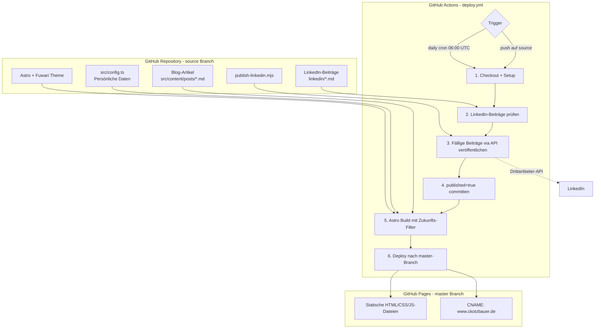

# Architekturplan: Persönliche Website & Blogplattform

## Übersicht

Kompletter Neuaufbau von [www.ckotzbauer.de](https://www.ckotzbauer.de) als statische Website mit Blog, basierend auf dem **Astro Static-Site-Generator** mit dem **Fuwari Theme**. Deployment über GitHub Pages (master-Branch).

---

## Projektstruktur

```
ckotzbauer.github.io/
├── .github/
│   └── workflows/
│       ├── build.yml                # PR-Build-Check
│       └── deploy.yml               # Build + Deploy + LinkedIn-Publishing
├── linkedin/                        # LinkedIn-Beiträge (NICHT Teil von Astro)
│   └── beispiel-beitrag.md
├── scripts/
│   └── publish-linkedin.mjs         # Node.js-Script für LinkedIn-Publishing
├── public/
│   ├── CNAME                        # Custom Domain: www.ckotzbauer.de
│   └── favicon/
├── src/
│   ├── assets/images/
│   │   └── avatar.jpg               # Profilbild (übernommen)
│   ├── config.ts                    # Fuwari-Konfiguration (personalisiert)
│   ├── content/
│   │   ├── config.ts                # Content-Collection-Schema (erweitert)
│   │   ├── posts/                   # Blog-Artikel als Markdown
│   │   │   └── willkommen.md        # Beispiel-Blogartikel
│   │   └── spec/
│   │       └── about.md             # Über-mich-Seite
│   ├── components/                  # Fuwari-Komponenten (Svelte/Astro)
│   ├── i18n/                        # Internationalisierung
│   ├── layouts/                     # Astro-Layouts
│   ├── pages/
│   │   ├── [...page].astro          # Startseite mit Pagination
│   │   ├── about.astro              # Über-mich-Seite
│   │   ├── archive.astro            # Archiv
│   │   ├── robots.txt.ts
│   │   └── posts/
│   │       └── [...slug].astro      # Einzelne Blogartikel
│   ├── plugins/                     # Rehype/Remark-Plugins
│   ├── styles/                      # Tailwind-Styles
│   ├── types/                       # TypeScript-Typen
│   └── utils/                       # Hilfsfunktionen
├── astro.config.mjs
├── package.json
├── pnpm-lock.yaml
├── tailwind.config.cjs
├── tsconfig.json
├── renovate.json
├── .gitignore
└── README.md
```

---

## Architektur-Diagramm



---

## Detailbeschreibung der Komponenten

### 1. Fuwari-Theme Initialisierung

Das Fuwari-Theme wird direkt als Template geklont und angepasst:

```bash
pnpm create astro@latest -- --template saicaca/fuwari
```

### 2. Personalisierung - src/config.ts

```typescript
export const siteConfig: SiteConfig = {
  title: "Christian Kotzbauer",
  subtitle: "Developer Blog",
  lang: "de",
  themeColor: { hue: 250, fixed: false },
  banner: { enable: false },
  toc: { enable: true, depth: 2 },
  favicon: [],
};

export const navBarConfig: NavBarConfig = {
  links: [
    LinkPreset.Home,
    LinkPreset.Archive,
    LinkPreset.About,
    {
      name: "GitHub",
      url: "https://github.com/ckotzbauer",
      external: true,
    },
  ],
};

export const profileConfig: ProfileConfig = {
  avatar: "assets/images/avatar.jpg",
  name: "Christian Kotzbauer",
  bio: "Developer | Kubernetes | Cloud Native | Open Source",
  links: [
    {
      name: "GitHub",
      icon: "fa6-brands:github",
      url: "https://github.com/ckotzbauer",
    },
    {
      name: "LinkedIn",
      icon: "fa6-brands:linkedin",
      url: "https://linkedin.com/in/ckotzbauer",
    },
    {
      name: "E-Mail",
      icon: "material-symbols:alternate-email",
      url: "mailto:christian.kotzbauer@gmail.com",
    },
  ],
};
```

### 3. About-Seite - src/content/spec/about.md

Enthält:

- Kurzvorstellung / Werdegang
- Technologie-Stack / Skills
- Zertifizierungen (CKA Badge)
- OSS-Projekte-Liste (die 9 bestehenden Projekte mit Links und Beschreibungen)

### 4. pubDate mit Zukunfts-Filterung

**Schema-Anpassung** in `src/content/config.ts`:
Das bestehende `published`-Feld von Fuwari unterstützt bereits `z.date()`, welches ISO-8601-Datetime-Strings parsen kann (z.B. `2026-03-15T10:00:00Z`). Es muss lediglich sichergestellt werden, dass die Filterung korrekt funktioniert.

**Filterung** in den Seiten, die Posts listen (z.B. `[...page].astro`, `archive.astro`, RSS-Feed):

```typescript
// Posts filtern: nur veröffentlichte und nicht in der Zukunft
const allPosts = await getCollection("posts");
const visiblePosts = allPosts.filter((post) => {
  const now = new Date();
  const pubDate = new Date(post.data.published);
  return !post.data.draft && pubDate <= now;
});
```

Diese Filterung muss an allen relevanten Stellen eingebaut werden:

- Startseite (`[...page].astro`)
- Archiv-Seite (`archive.astro`)
- RSS-Feed
- Post-Navigation (prev/next)
- Einzelpost-Seiten (`posts/[...slug].astro`)

### 5. Blog-Artikel Format

```markdown
---
title: Mein erster Blogartikel
published: 2026-02-15T10:00:00Z
tags: [Astro, Blog]
category: Allgemein
description: Ein Beispiel-Blogartikel
draft: false
---

# Inhalt hier...
```

### 6. LinkedIn-Beiträge

**Ordnerstruktur**: `linkedin/` im Repository-Root (außerhalb von `src/`, nicht von Astro erfasst)

**Format**:

```markdown
---
title: LinkedIn Post Titel
pubDate: 2026-03-01T09:00:00Z
published: false
---

Hier steht der LinkedIn-Beitragstext...
Kann Markdown enthalten, wird aber als Plain Text extrahiert.
```

**Publishing-Script** (`scripts/publish-linkedin.mjs`):

1. Liest alle `.md`-Dateien aus `linkedin/`
2. Parst Frontmatter
3. Prüft: `pubDate <= now` UND `published === false`
4. Für fällige Beiträge: API-Call an Drittanbieter (z.B. Zapier Webhook, Buffer API, oder Make.com)
5. Bei Erfolg: `published: true` im Frontmatter setzen
6. Geänderte Dateien werden von der GitHub Action zurück-committed

**Drittanbieter-Integration**:
Das Script wird so gebaut, dass die API-URL als Environment-Variable (`LINKEDIN_WEBHOOK_URL`) konfiguriert wird. Der tatsächliche Drittanbieter-Service kann flexibel gewählt werden. Das Script sendet einen POST-Request mit dem Beitragsinhalt als JSON-Payload.

### 7. GitHub Actions

**deploy.yml** - Haupt-Workflow:

```yaml
name: deploy

on:
  push:
    branches: [source]
  schedule:
    - cron: "0 6 * * *" # Täglich um 06:00 UTC (07:00 CET)
  workflow_dispatch: {}

jobs:
  deploy:
    runs-on: ubuntu-latest
    permissions:
      contents: write
    steps:
      - uses: actions/checkout@v4

      - name: Setup pnpm
        uses: pnpm/action-setup@v4

      - name: Setup Node.js
        uses: actions/setup-node@v4
        with:
          node-version: 22
          cache: pnpm

      - name: Install dependencies
        run: pnpm install --frozen-lockfile

      - name: Publish LinkedIn posts
        env:
          LINKEDIN_WEBHOOK_URL: ${{ secrets.LINKEDIN_WEBHOOK_URL }}
        run: node scripts/publish-linkedin.mjs

      - name: Commit LinkedIn status updates
        run: |
          git config user.name "github-actions[bot]"
          git config user.email "github-actions[bot]@users.noreply.github.com"
          git add linkedin/
          git diff --cached --quiet || git commit -m "chore: mark LinkedIn posts as published"
          git push || true

      - name: Build Astro site
        run: pnpm build

      - name: Deploy to GitHub Pages
        uses: JamesIves/github-pages-deploy-action@v4
        with:
          branch: master
          folder: dist
```

**build.yml** - PR-Check:

```yaml
name: build

on:
  pull_request:
    branches: ["**"]

jobs:
  build:
    runs-on: ubuntu-latest
    steps:
      - uses: actions/checkout@v4
      - uses: pnpm/action-setup@v4
      - uses: actions/setup-node@v4
        with:
          node-version: 22
          cache: pnpm
      - run: pnpm install --frozen-lockfile
      - run: pnpm build
```

---

## Bestehende Dateien - Behandlung

| Aktion          | Dateien                                                                                                                                               |
| --------------- | ----------------------------------------------------------------------------------------------------------------------------------------------------- |
| **Löschen**     | Alle (app/, build/, content/, index.ejs, package.json, package-lock.json, tsconfig.json, .github/workflows/\*, .github/label-commands.json, .vscode/) |
| **Übernehmen**  | content/images/avatar.jpg → src/assets/images/avatar.jpg, content/images/cka.png → src/assets/images/cka.png                                          |
| **Beibehalten** | renovate.json (anpassen), README.md (neu schreiben), .gitignore (neu schreiben)                                                                       |

---

## Offene Konfigurationspunkte

1. **Drittanbieter für LinkedIn**: Konkreter Service muss gewählt und eingerichtet werden. Das Script wird generisch mit Webhook-URL gebaut.
2. **LinkedIn-Profil-URL**: Muss für den profileConfig-Link bestätigt werden.
3. **Profilbild**: Das bestehende avatar.jpg wird übernommen.
4. **Werdegang/Bio**: Muss für die About-Seite noch im Detail getextet werden (Platzhalter wird erstellt).
5. **OSS-Projekte**: Die 9 bestehenden werden als Liste übernommen, aktuellere Beschreibungen können nachträglich angepasst werden.
