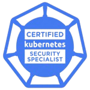

# About Me

## Christian Hopf

My journey in software engineering started during my trainee program as a software developer, where I developed warehouse management software for intralogistics using Java and Swing. I then transitioned to web development, building applications with .NET Framework (later .NET Core) and ASP.NET. Over the years, I created single-page applications using Durandal, Knockout, and Aurelia, and led the development of a call center ticketing system with AI-based classification. As technical team lead, I guided the team for many years while simultaneously establishing and leading a DevOps Kubernetes team from 2020, responsible for operating and hosting all company applications.

Since 2022, I've been a nerd at [Nerdware](https://nerdware.dev), working as Lead Software Engineer and Business Unit Lead for a larger development team. I'm currently working on enterprise HR software (AWS, .NET Core microservices, Angular, Storybook) and an AI agent platform for a major German customer.

### Skills

- **Languages:** TypeScript, Java, C#, Go, Python
- **Frameworks:** Aurelia, Angular, ASP.NET, Entity Framework, Gorm, Gin, Storybook, Nest.js, Terraform, AWS CDK, XGBoost, ...
- **Tools/Hosting:** Docker, Kubernetes, Keycloak, Elasticsearch, Kibana, Prometheus, Grafana, Cert-Manager, External Secrets, AWS, Hetzner Cloud, ...
- **Focus:** Web-Development, Cloud Native, Cloud-Hosting, AI, Leadership

### Certifications

**Certified Kubernetes Administrator (CKA)**

**Certified Kubernetes Security Specialist (CKS)**

### Open Source Projects

#### [sbom-operator](https://github.com/ckotzbauer/sbom-operator)

Catalogue all images of a Kubernetes cluster to multiple targets with Syft.

#### [vulnerability-operator](https://github.com/ckotzbauer/vulnerability-operator)

Scans SBOMs for vulnerabilities with Grype.

#### [aurelia-knockout](https://github.com/aurelia-contrib/aurelia-knockout)

Aurelia plugin that enables the usage of Knockout bindings alongside Aurelia.

#### [cache-bust-loader](https://github.com/ckotzbauer/cache-bust-loader)

Webpack loader to enable cache-busting with query parameters.

#### [access-manager](https://github.com/ckotzbauer/access-manager)

Kubernetes operator to simplify RBAC configurations.

### Contact

- **Email:** [git@ckotzbauer.de](mailto:git@ckotzbauer.de)
- **GitHub:** [github.com/ckotzbauer](https://github.com/ckotzbauer)
- **LinkedIn:** [linkedin.com/in/christian-hopf-84b3462b2/](https://www.linkedin.com/in/christian-hopf-84b3462b2/)
